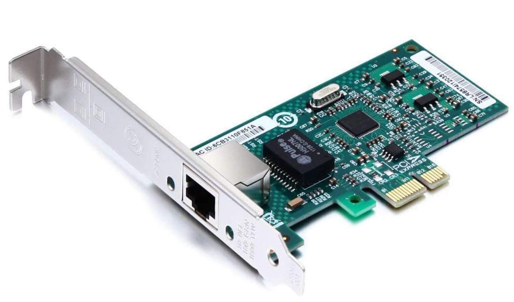

#Út a nested virtualizációhoz

Nagyon korlátozott a hardver elemek támogatása, nem egyszerű otthoni környezetben életre kelteni. Alapból a komolyabb szerverekkel, és bennük lévő hardver elemekkel kompatibilis.

Nagyon sok régebbi hardver elem támogatását dobták a 7-es verzióval. Nem csak LAN, hanem storage eszközök szintjén is. (Rengeteg AHCI, NVMe vezérlő esett ki)

Gond lehet még egyes újabb architektúrák miatt is, amibe én bele is futottam. A P/E CPU magok miatt egy ellenőrzés hibára fut, és el sem indul alapból. (itt nem BSOD, hanem PSOD van)

**12th Gen Intel CPU esetén a megoldás:**

Indításkor meg kell adni a  ```cpuUniformityHardCheckPanic=FALSE ``` kernel opciót. (SHIFT + O)

**Amikor pedig már fut a rendszer SSH-n:**

 ```esxcli system settings kernel set -s cpuUniformityHardCheckPanic -v FALSE ```

Az egyik alapvető legfontosabb dolog, ami szükséges a működéséhez az egy kompatibilis hálózati kártya. Leginkább Intel, és Broadcom chipset alapú LAN eszközök vannak a támogatási listán. (Persze a hétköznapi integrált eszközök nagy része valamilyen Realtek alapú eszköz, amit itt el is lehet felejteni.)

<a href="https://www.vmware.com/resources/compatibility/search.php?deviceCategory=io" target="_blank">Ezen a linken</a> lehet pontosan keresni nem csak pontos szerver típusokra, hanem hardver elemekre is.

Amit tudok javasolni, ha valaki próbálkozna, teljes mértékben támogatott az Intel 82574L chipset. Ezek azért még emberi áron beszerezhetők, azért élőben megcsinálni dolgokat, vagy megnézni egy videón kicsit más.

Én ezt használtam: 10Gtek®-EXPI9301CT-Controller (82574L)



Otthoni teszt környezethez szerintem bőven jó.

A következő buktató a tárhely volt. Mivel kevés „hétköznapi, alap otthoni” chipset támogatott, ha nincs szerencséd, elindul a rendszer, de nem fog semmilyen tárhelyet látni, mivel nem fogja tudni kezelni az alaplapodon lévő AHCI / NVMe vezérlőt.

**Erre több megoldás is van:**

- Külső USB Drive / Pendrive
- iSCSI megosztás
- NFS megosztás
- vSAN storage

Nálam az iSCSI lett a befutó megoldás. Egy Windows Server 2019-et használtam a megvalósításhoz.

Itt már eljutottam arra a pontra, hogy tudtam egy alap ESXi-vel ismerkedni, viszont minden más komolyabb dolog kipróbálásához több ESXi hostra volt szükségem.

Itt jött a képbe a Nested virtualizáció, mint lehetséges opció.