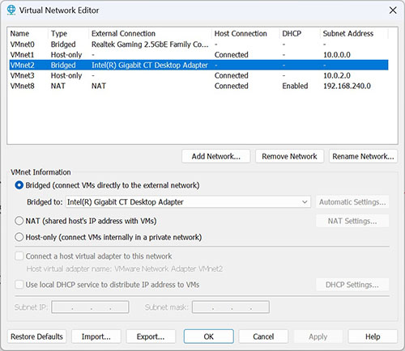
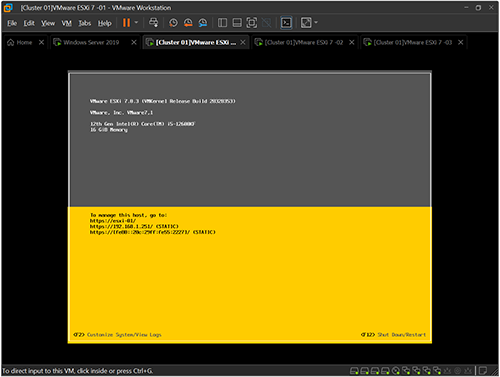

#Út a nested virtualizációhoz
A legegyszerűbb, és szerintem legjobb megoldás egy jól használható teszt környezet kialakításához megfelelően erős hardver komponensek esetén a Nested virtualizáció.

VMware Workstation-ben is lehet ESXi hostokat futtatni. Nested virtualizációs technikával élő környezetben ilyet nyilván nem csinálunk, de gyakorlatozni több, mint jó.

Itt már nem feltétlenül kell kompatibilis hálózati kártyával sem rendelkeznünk, mivel a VMware Workstation tudja többféle módon is kezelni a hivatalosan nem támogatott hálózati eszközeinket is, és ezt már képes kezelni az ESXi-is.

**Többféle mód is rendelkezésre áll:**

Egyszerűen megoldódik a tárhely probléma is, mivel a fizikailag nem támogatott AHCI/NVMe vezérlőn létrehozott virtuális tároló eszközöket már hiba nélkül felismeri a rendszer, és képes kezelni is.

Jelen esetben is rendelkezésünkre áll pl. a Snapshot kezelés lehetősége is, ami nagyban meg tudja könnyíteni a gyakorlatozást, hiszen pillanatok alatt visszatérhetünk egy alap telepítéshez.

Ez leginkább Cluster-es dolgok tesztelésénél fog nagyon jól jönni. Innentől kezdve pedig adott a lehetőség több ESXi host létrehozásához.

