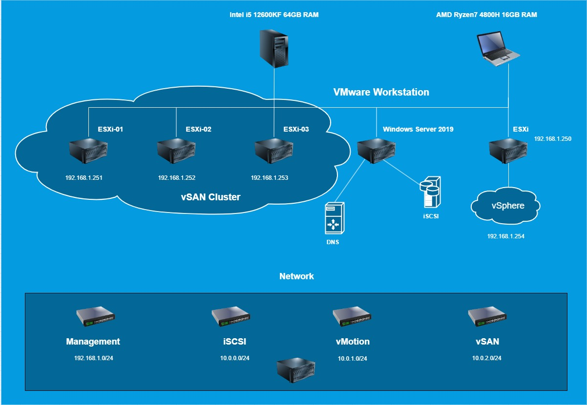

#A saját teszt környezet

Ez az alap teszt környezet nélkülöz minden éles környezetben alapvetően szükséges dolgot, pl. hálózati redundancia, a Single Point of Failure típusú hibák kizárásához.

1. Notebook (AMD Ryzen 7 4800h, 16GB RAM) Nested ESXi 7.03 (192.168.1.250)
2. Asztali (Intel i5-12600KF, 64GB RAM)

Az asztali gépen Nested virtualizációban futnak az ESXi host-ok.

esxi-01.bryan86.cloud (192.168.1.251)

esxi-02.bryan86.cloud (192.168.1.252)

esxi-03.bryan86.cloud (192.168.1.253)

A vSphere a notebook-on lévő ESXi host-on fut. (192.168.1.254)

Ennek alapja a vCenter Appliance, ami tulajdonképpen egy virtuális gép Nested virtualizációval, ami a gépen lévő ESXi host-on fut.

A vCenter Appliance a 5480-as porton érhető el alapból, SSH elérés is lehetséges hozzá. (be kell kapcsolni, alapból tiltva van)

iSCSI, és DNS szerver egy Windows Server 2019 VM-en. (Az asztali gépen) (192.168.1.40)

Tárhelyre a korábban már említett iSCSI, és később egy saját vSAN Cluster lett használva. A funkciók rendes, életszerű működéséhez szükséges a SAN rendszerű látásmód, megközelítés, ezt javaslom mindenkinek.

